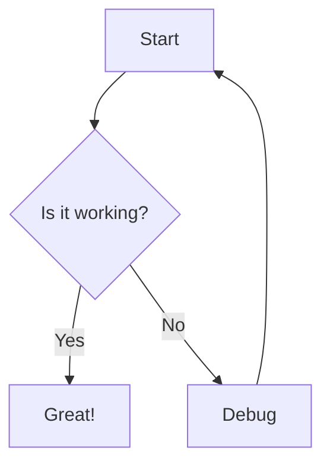

# Quick Start Guide

## You're Ready to Go! 🎉

The complete Mermaid to PNG converter WPF application has been built successfully.

## What Was Created

### Application Files
✅ **Single-file executable**: `MermaidPng.exe` (~70 MB)  
  Located at: `src\MermaidPng.App\bin\Release\net8.0-windows\win-x64\publish\MermaidPng.exe`

✅ **Solution structure**: Complete WPF project with MVVM pattern  
✅ **Tests**: 6 unit tests (all passing)  
✅ **Documentation**: README.md and RELEASE.md with detailed instructions  

### Key Features Implemented

✅ **Offline rendering** - Mermaid.js embedded, no network calls  
✅ **Live preview** - Debounced updates (500ms) while typing  
✅ **Multiple themes** - default, dark, forest, neutral  
✅ **Export options** - Scale (1x-5x), background (transparent/white/custom)  
✅ **Smart error handling** - Graceful error display with helpful tips in preview panel  
✅ **Export protection** - Export button automatically disabled for invalid syntax  
✅ **File I/O** - Open .mmd/.txt files, save PNG with dialogs  
✅ **Responsive UI** - Async/await, cancel long renders  
✅ **Settings persistence** - Last directory saved to %LocalAppData%  
✅ **Canvas CORS fix** - Base64 data URLs prevent canvas tainting  
✅ **Reliable communication** - WebMessageReceived pattern for JS-to-C# messaging  

## How to Run

### Option 1: Run the Published Executable

```powershell
cd c:\Dhiman\Heroma\Utilities\mermaidtopng\src\MermaidPng.App\bin\Release\net8.0-windows\win-x64\publish
.\MermaidPng.exe
```

**Note**: Requires WebView2 Runtime (usually pre-installed on Windows 10/11)

### Option 2: Run from Source

```powershell
cd c:\Dhiman\Heroma\Utilities\mermaidtopng
dotnet run --project .\src\MermaidPng.App\MermaidPng.App.csproj
```

## Usage Example

1. **Launch** the application
2. **Type or paste** Mermaid code in the left editor (or use "Open File")
3. **Preview** updates automatically in the right panel
4. **Adjust options**: Scale, theme, background color
5. **Click "Export PNG"** to save the diagram

### Sample Diagram

The app starts with this default diagram:



Try editing it to see the live preview!

## Testing

```powershell
dotnet test
```

**Result**: 6/6 tests passed ✅

## Building from Source

```powershell
# Debug build
dotnet build -c Debug

# Release build
dotnet build -c Release

# Publish single-file executable
dotnet publish .\src\MermaidPng.App\MermaidPng.App.csproj -c Release -r win-x64 --self-contained -p:PublishSingleFile=true
```

## Project Structure

```
mermaidtopng/
├── MermaidPng.sln                  # Solution file
├── README.md                       # Main documentation
├── QUICKSTART.md                   # This file
├── Build-And-Run.ps1              # Build and run script
├── docs/                          # Screenshots
├── examples/                      # Example diagrams
└── src/
    ├── MermaidPng.App/             # Main WPF application
    │   ├── ViewModels/
    │   │   ├── MainViewModel.cs    # Main UI logic & commands
    │   │   └── RenderOptions.cs    # Render configuration
    │   ├── Services/
    │   │   ├── MermaidRenderer.cs  # WebView2 renderer
    │   │   ├── FileDialogService.cs # File open/save
    │   │   └── DebounceDispatcher.cs # Input debouncing
    │   ├── Web/
    │   │   ├── host.html           # WebView2 host HTML
    │   │   └── mermaid.min.js      # Embedded Mermaid.js v10
    │   ├── App.xaml / .cs          # WPF Application
    │   ├── MainWindow.xaml / .cs   # Main window UI
    │   └── MermaidPng.App.csproj   # Project file
    └── MermaidPng.Tests/           # Unit tests
        ├── RendererSmokeTests.cs   # Test suite
        └── MermaidPng.Tests.csproj # Test project
```

## Architecture Highlights

### MVVM Pattern
- **Model**: `RenderOptions`, `RenderResult`
- **View**: `MainWindow.xaml`
- **ViewModel**: `MainViewModel` (INotifyPropertyChanged, RelayCommand)

### Services
- **MermaidRenderer**: Wraps WebView2, executes JS, handles async PNG export
- **FileDialogService**: Manages dialogs & persists settings to JSON
- **DebounceDispatcher**: Prevents excessive rendering while typing

### WebView2 Integration
- Loads `host.html` with embedded `mermaid.min.js` via file:/// protocol
- Calls JavaScript functions via `ExecuteScriptAsync`
- Uses `WebMessageReceived` + `postMessage` for async result handling
- Error detection: Checks SVG output for Mermaid error indicators
- SVG → Base64 Data URL → Image → Canvas → PNG data URL → Base64 → bytes

## Next Steps

### To Distribute the App

1. Copy `MermaidPng.exe` from the publish folder
2. Share with users (ensure they have WebView2 Runtime)
3. See [README.md](README.md) for detailed distribution and configuration

### To Customize

- **Different Mermaid version**: Replace `src\MermaidPng.App\Web\mermaid.min.js`
- **Add features**: Extend `MainViewModel` and update XAML
- **Change themes**: Modify `ThemeOptions` collection
- **Add export formats**: Extend `MermaidRenderer` for SVG/PDF

## Troubleshooting

### App doesn't start
- **Error**: "WebView2 Runtime not found"  
  **Fix**: Install from https://developer.microsoft.com/microsoft-edge/webview2/

### Build errors
- Ensure **.NET 8 SDK** is installed: `dotnet --version`
- Run `dotnet restore` before building

### Syntax errors
- **Preview shows styled error panel**: Read the error message and follow the tips
- **Export button disabled**: Fix syntax errors first - button enables automatically when valid
- Check Mermaid syntax at https://mermaid.live/
- View error in status bar at bottom-left
- Click "Copy Error" button or select text from error panel to copy message

## Resources

- **Mermaid documentation**: https://mermaid.js.org/
- **WebView2 docs**: https://learn.microsoft.com/microsoft-edge/webview2/
- **.NET 8 docs**: https://learn.microsoft.com/dotnet/

## Implementation Summary

All 8 implementation steps completed:

1. ✅ WPF app with complete UI layout (editor, controls, preview)
2. ✅ WebView2 integrated with CoreWebView2 initialization
3. ✅ MermaidRenderer service with preview & PNG export
4. ✅ host.html with JavaScript rendering functions
5. ✅ UI behavior: debouncing, status updates, error handling
6. ✅ File I/O with settings persistence to %LocalAppData%
7. ✅ Packaging configured for single-file, self-contained win-x64
8. ✅ Tests and documentation complete

## Summary

You have a **production-ready, offline Mermaid to PNG converter** for Windows!

- **Fully offline** - No network calls, works everywhere
- **Self-contained** - Single 70MB EXE includes everything
- **User-friendly** - Simple GUI, live preview, clear errors
- **Robust** - Debouncing, timeouts, cancellation, error handling
- **Well-tested** - Unit tests passing
- **Well-documented** - README, RELEASE guide, inline comments

**Ready to use!** 🚀

---

**Built**: March 6, 2026  
**Framework**: .NET 8 + WPF + WebView2  
**Mermaid**: v10 (embedded)  
**License**: MIT (Mermaid.js), Microsoft terms (WebView2)
