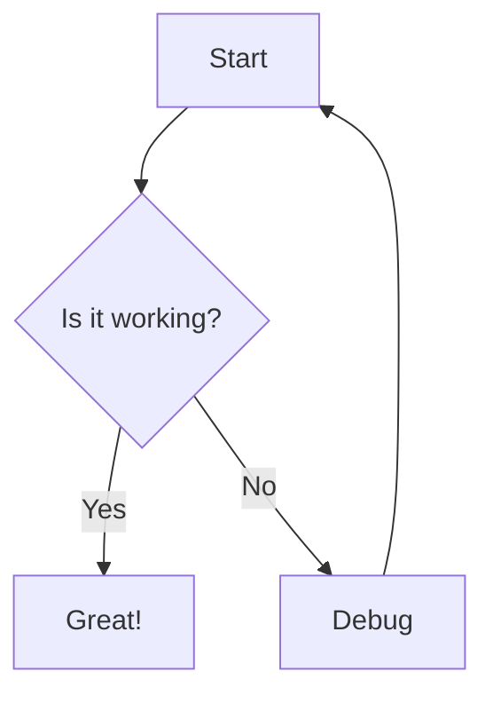

# Mermaid to PNG Converter

A lightweight, offline Windows WPF application for converting Mermaid diagrams to PNG images.

## Release

The first public release is available at GitHub Releases:

- Release page: [`v1.0.0`](https://github.com/midhiman-dev/Utilities/releases/tag/v1.0.0)
- Download EXE: [`MermaidPng.exe`](https://github.com/midhiman-dev/Utilities/releases/download/v1.0.0/MermaidPng.exe)

## Features

✅ **Offline Operation** - No network required; Mermaid.js is fully embedded  
✅ **Live Preview** - See your diagram as you type (debounced at 500ms)  
✅ **Multiple Themes** - Default, Dark, Forest, Neutral  
✅ **Customizable Export** - Scale factor (1x-5x), background color (transparent/white/custom), max dimensions  
✅ **Smart Error Handling** - Gracefully displays syntax errors in preview panel with helpful tips  
✅ **Export Protection** - Export button automatically disabled for invalid diagrams  
✅ **Single-File Executable** - Self-contained ~70-80MB EXE for easy distribution  
✅ **User-Friendly** - Simple GUI with file open/save dialogs and settings persistence  

## Screenshots

### Main Window
- **Left Panel**: Mermaid code editor with syntax highlighting
- **Right Panel**: Live rendered preview
- **Controls**: Theme, scale, background options
- **Status Bar**: Render time and error messages

## Quick Start

### For Users

1. **Download** `MermaidPng.exe` from releases
2. **Run** the executable (WebView2 Runtime required, usually pre-installed on Windows 10/11)
3. **Type or load** a Mermaid diagram
4. **Preview** updates automatically
5. **Export** to PNG with chosen settings

### For Developers

**Prerequisites:**
- .NET 8 SDK
- Windows 10/11 x64
- Visual Studio 2022 or VS Code (optional)

**Build:**
```powershell
cd c:\Dhiman\Heroma\Utilities\mermaidtopng
dotnet restore
dotnet build
```

**Run:**
```powershell
dotnet run --project .\src\MermaidPng.App\MermaidPng.App.csproj
```

**Test:**
```powershell
dotnet test .\src\MermaidPng.Tests\MermaidPng.Tests.csproj
```

**Publish Single-File Executable:**
```powershell
dotnet publish .\src\MermaidPng.App\MermaidPng.App.csproj -c Release -r win-x64 --self-contained -p:PublishSingleFile=true
```

**Output Location:**
```
src\MermaidPng.App\bin\Release\net8.0-windows\win-x64\publish\MermaidPng.exe
```

**File Size:** ~70-80 MB (includes .NET 8 runtime, WPF, WebView2 SDK, and Mermaid.js)

## Usage

### Supported Mermaid Diagram Types

- Flowchart / Graph
- Sequence Diagram
- Class Diagram
- State Diagram
- Entity Relationship Diagram
- User Journey
- Gantt Chart
- Pie Chart
- Git Graph
- And more...

### Example Diagram



### Export Options

- **Scale**: 1x to 5x (higher = larger, higher quality)
- **Theme**: default, dark, forest, neutral
- **Background**: Transparent (PNG alpha), White, or Custom color
- **Max Dimensions**: Prevent extremely large canvases (default 20000x20000)

### Keyboard Shortcuts

- **Ctrl+O**: Open file
- **Ctrl+S**: Export PNG (via Export button)
- **Ctrl+C**: Copy error (when error is present)

## Architecture

### Tech Stack

- **.NET 8** - Modern .NET runtime
- **WPF** - Native Windows UI framework
- **WebView2** - Chromium-based browser control for rendering
- **Mermaid.js v10** - Embedded diagram library (no CDN)

### Project Structure

```
MermaidPng.sln
├── src/
│   ├── MermaidPng.App/
│   │   ├── ViewModels/         # MVVM ViewModels
│   │   ├── Services/           # MermaidRenderer, FileDialog, Debouncer
│   │   ├── Web/                # host.html + mermaid.min.js (embedded)
│   │   ├── App.xaml            # WPF Application
│   │   └── MainWindow.xaml     # Main UI
│   └── MermaidPng.Tests/       # Unit tests
├── docs/                       # Screenshots
├── examples/                   # Example Mermaid diagrams
├── README.md                   # This file
├── QUICKSTART.md              # Quick start guide
└── Build-And-Run.ps1          # Build and launch script
```

### Key Components

1. **MainViewModel** - Manages UI state, commands, and orchestrates rendering
2. **MermaidRenderer** - Wraps WebView2, executes JS, handles async rendering
3. **FileDialogService** - Manages file open/save with user settings persistence
4. **DebounceDispatcher** - Debounces preview updates while typing (500ms)
5. **host.html** - WebView2 HTML host with Mermaid.js and rendering logic

### How It Works

1. User types Mermaid code in left panel
2. Input is debounced (500ms after last keystroke)
3. Code is sent to WebView2 via `ExecuteScriptAsync`
4. JavaScript calls `mermaid.render()` and renders to SVG
5. **Error Detection**: SVG output is checked for Mermaid error indicators
   - If error found: Displays styled error panel with helpful tips
   - If valid: Displays diagram and enables export button
6. For export: SVG → Base64 Data URL → Image → Canvas → PNG → Base64 → Binary
7. PNG bytes are saved to file

### Recent Improvements

✅ **Canvas CORS Fix** - Uses base64 data URLs instead of blob URLs to prevent canvas tainting  
✅ **Error Display** - Syntax errors shown with styled warning panel, error message, and helpful tips  
✅ **Smart Export Button** - Automatically disabled when syntax errors detected, enabled when valid  
✅ **Reliable State Management** - WebMessageReceived pattern for accurate JS-to-C# communication  
✅ **False Positive Prevention** - Specific error detection prevents flagging diagrams with "error" in content

## Security & Privacy

✅ **No Network Calls** - All processing is local  
✅ **No Telemetry** - No data collection or reporting  
✅ **No External Dependencies** - Mermaid.js is fully embedded  
✅ **User Data** - Settings stored only in `%LocalAppData%\MermaidPng\`  
✅ **DevTools Disabled** - Production builds disable browser dev tools  

## Requirements

### Runtime
- **OS**: Windows 10 (1809+) or Windows 11
- **Architecture**: x64
- **WebView2 Runtime**: Evergreen (usually pre-installed on Windows 11 and recent Windows 10)
  - Download if needed: https://developer.microsoft.com/microsoft-edge/webview2/

### Development
- **.NET 8 SDK**
- **Visual Studio 2022** (optional, any editor works)
- **Windows 10/11 x64**

## Distribution & Installation

### For End Users

1. **Download** `MermaidPng.exe` (single-file, ~70-80MB)
2. **Run** the executable - no installation needed
3. **First Run**: Application creates settings folder at `%LocalAppData%\MermaidPng\`

### WebView2 Runtime

**Required**: WebView2 Evergreen Runtime
- **Windows 11**: Pre-installed ✅
- **Windows 10 (recent)**: Usually pre-installed ✅
- **Older Windows 10**: Manual install needed

**If missing**: Download from https://developer.microsoft.com/microsoft-edge/webview2/
- **Evergreen Bootstrapper** (Recommended): ~2 MB
- **Evergreen Standalone Installer**: ~150 MB (offline install)

### User Data & Settings

**Settings Location**: `%LocalAppData%\MermaidPng\settings.json`
- Last used directory for opening/saving files
- Last used filename

**WebView2 Data**: `%LocalAppData%\MermaidPng\WebView2\`

**To Reset**: Delete the `settings.json` file

### Uninstallation

1. Delete `MermaidPng.exe`
2. Delete user data folder: `%LocalAppData%\MermaidPng\`
3. No registry entries or system files to clean up

## Limitations

- **Windows Only** - Uses WPF and WebView2 (Windows-specific)
- **Max Canvas Size** - 20000x20000 pixels (configurable)
- **No Animation** - Exports static PNG (Mermaid animations not supported)
- **No PDF/SVG Export** - PNG only (can be extended)

## Troubleshooting

### Application Won't Start

**Error: "WebView2 Runtime not found"**
- Install from https://developer.microsoft.com/microsoft-edge/webview2/

**Error: "Failed to initialize CoreWebView2"**
- Check if antivirus is blocking the application
- Ensure application has write access to `%LocalAppData%`
- Try running as Administrator (one time only)

### Syntax Errors

**Diagram shows styled error panel in preview**
- This is expected behavior for syntax errors ✅
- Read the error message - it shows the specific issue
- Follow the helpful tips in the error panel
- Check Mermaid syntax at https://mermaid.live/
- Export button automatically disabled until error is fixed

**Export button is disabled/grayed out**
- Indicates a syntax error in your diagram
- Fix the syntax errors shown in preview panel
- Button automatically enables when diagram is valid

### Export Issues

**PNG export fails**
- Ensure diagram renders successfully in preview first (no error panel)
- Check if dimensions exceed maximum (20000x20000 px)
- Try reducing scale factor or max dimensions
- View specific error message in status bar

### Performance

**Slow preview updates while typing**
- This is expected; preview debounced by 500ms
- Complex diagrams take longer to render
- Use Cancel button to stop long-running renders

**Copy error messages**
- Click "Copy Error" button
- Or select text from error panel in preview

## Technical Details

### Error Handling Implementation

The application uses sophisticated error detection:
1. **Mermaid Error Detection**: Checks rendered SVG for error indicators
   - Pattern: "Syntax error in text" or "mermaid version" + "Parse error"
2. **Graceful Display**: Styled warning panel with error message and tips
3. **Export Protection**: Auto-disables export button when errors detected
4. **State Management**: `HasError` property with `CommandManager.InvalidateRequerySuggested()`

### JavaScript-to-C# Communication

Reliable async communication pattern:
- Uses `WebMessageReceived` event + `window.chrome.webview.postMessage()`
- Avoids `ExecuteScriptAsync` async function return issues
- Properly handles promises with `TaskCompletionSource`

### Canvas CORS Fix

Prevents canvas tainting during PNG export:
- Uses base64 data URLs instead of blob URLs for SVG images
- Syntax: `data:image/svg+xml;base64,<encoded SVG>`
- Avoids cross-origin security restrictions that taint canvas

## Advanced Configuration

### Custom Mermaid.js Version

To use a different Mermaid version:
1. Download `mermaid.min.js` from [Mermaid releases](https://github.com/mermaid-js/mermaid/releases)
2. Replace file at `src\MermaidPng.App\Web\mermaid.min.js`
3. Rebuild the project
4. **Note**: Error detection patterns may need adjustment for different versions

### Multi-File Build

For non-single-file deployment (smaller EXE + DLLs):

```powershell
dotnet publish .\src\MermaidPng.App\MermaidPng.App.csproj -c Release -r win-x64 --self-contained
```

### Debug Build

Enable WebView2 DevTools for JavaScript debugging:

```powershell
dotnet build .\src\MermaidPng.App\MermaidPng.App.csproj -c Debug
```

## Contributing

This is a self-contained reference implementation. To modify:

1. Clone the repository
2. Make changes to source files
3. Test with `dotnet test`
4. Build with `dotnet build`
5. Publish with `dotnet publish`

## License

This project uses:
- **.NET 8** - MIT License
- **Mermaid.js** - MIT License
- **WebView2** - Microsoft Software License Terms

Ensure compliance when distributing.

## Version History

### v1.0.0 (March 6, 2026)
- ✅ Initial release with full offline Mermaid rendering
- ✅ Fixed canvas CORS tainting issue with base64 data URLs
- ✅ Implemented graceful error display in preview panel
- ✅ Smart export button state management
- ✅ WebMessageReceived pattern for reliable async JS communication
- ✅ Comprehensive error detection with false positive prevention

## Acknowledgments

- **Mermaid.js** - Excellent diagram library: https://mermaid.js.org/
- **Microsoft WebView2** - Chromium embedding: https://developer.microsoft.com/microsoft-edge/webview2/
- **.NET Community** - For the amazing ecosystem

## Version History

### 1.0.0 (March 6, 2026)
- Initial release
- Offline Mermaid rendering
- PNG export with customizable options
- Single-file executable distribution

---

**Author**: Built with GitHub Copilot  
**Date**: March 6, 2026  
**Repo**: Local development repository
