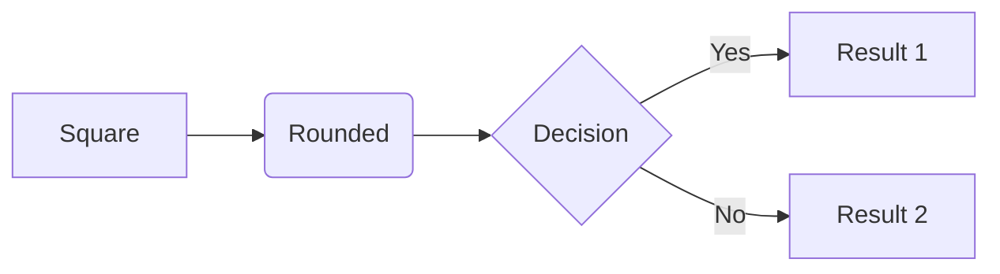
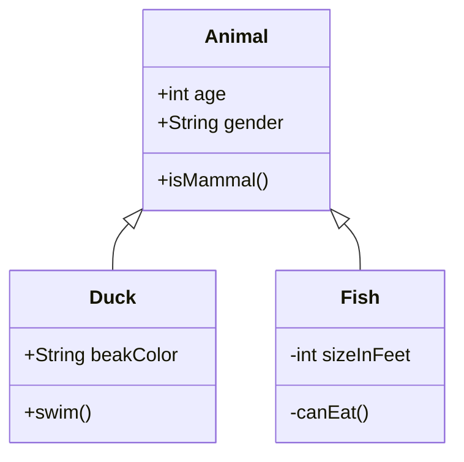
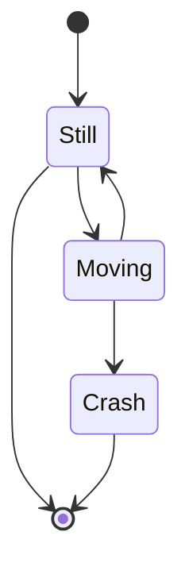
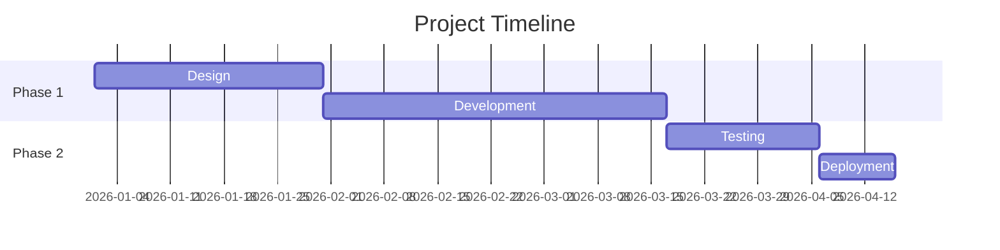
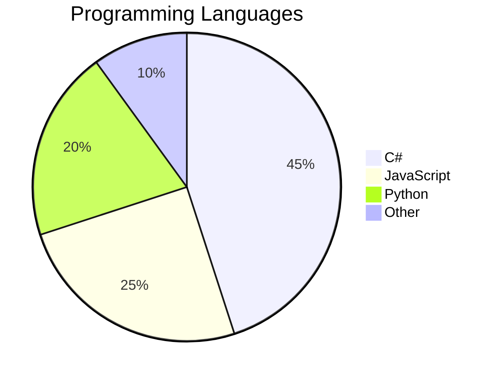

# Example Mermaid Diagrams

This folder contains sample Mermaid diagram files that you can open in the application to test various diagram types.

## Files

- **sample.mmd** - Simple flowchart with styling
- **sequence.mmd** - Sequence diagram showing the app's architecture

## Try These Diagram Types

### Flowchart

### Class Diagram

### State Diagram

### Gantt Chart

### Pie Chart

## Tips

1. Copy any of the examples above into the app's editor
2. The preview will update automatically after you stop typing
3. Experiment with different themes (dark, forest, neutral)
4. Try different scale factors for higher quality exports
5. Use transparent background for diagrams you'll overlay on other content
